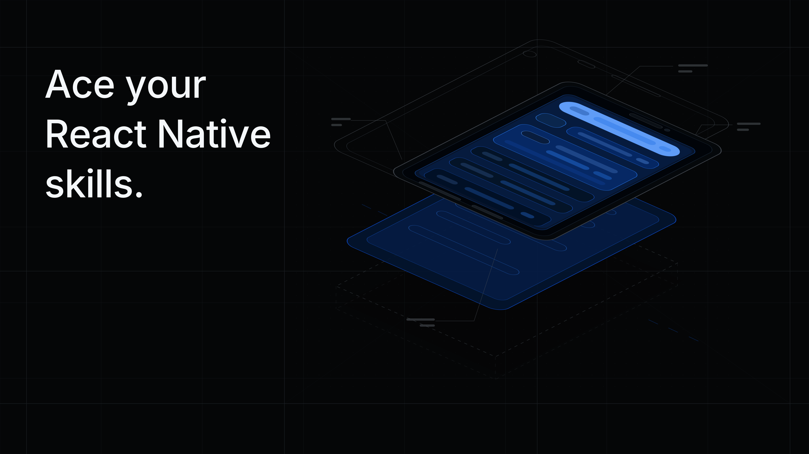

<a id="top"></a>

<p align="center">
  
</p>

# React Native Interview Prep 2026

Modern React Native interview questions for people who want to think like production engineers, not memorize outdated trivia.

Last reviewed: **2026-05-12**  
Baseline: **React Native 0.85 stable**, New Architecture-only era, Hermes V1 default, React 19.2.x, modern React Native DevTools.


## Table of Contents

| No. | Section |
| --- | ------- |
| 1 | [How to Use This Guide](#how-to-use-this-guide) |
| 2 | [What Counts as Current](#what-counts-as-current) |
| 3 | [Junior Questions](#junior-questions) |
| 4 | [Middle Questions](#middle-questions) |
| 5 | [Senior Questions](#senior-questions) |
| 6 | [God Mode Questions](#god-mode-questions) |
| 7 | [Source Trail](#source-trail) |
| 8 | [Contributing](#contributing) |

## How to Use This Guide

Each question is written in interview style. The answer is intentionally short: enough to pass an interviewer checkmark, but not a full article. If you can explain the answer, add one real project example, and mention one tradeoff, you are in good shape.

The levels are not about job titles only:

- **Junior**: proves you can build and debug screens without superstition.
- **Middle**: proves you understand performance, native boundaries, and release realities.
- **Senior**: proves you can make architecture, migration, and product tradeoffs.
- **God Mode**: proves you understand React Native internals well enough to debug hard production failures and guide platform strategy.

## What Counts as Current

- React Native **0.82+** runs on the New Architecture only.
- React Native **0.84+** uses **Hermes V1 by default**.
- React Native **0.85** is the latest stable version at this review date.
- The modern architecture includes Fabric, TurboModules, Codegen, JSI, Hermes, modern DevTools, and React 19 features.
- Expo SDK releases intentionally track specific React Native versions, so interview answers should mention version alignment instead of assuming every Expo project is on latest React Native.
- Performance answers should start with measurement: React Native DevTools, performance marks, release builds, device profiling, and production telemetry.
- List answers should know the tradeoffs between `FlatList`, FlashList v2, and LegendList instead of blindly replacing every list.
- Web answers should treat React Native for Web as a shared platform target with real browser constraints, not as "mobile UI in a tab."
- AI answers should distinguish cloud APIs, streaming transport, and local on-device inference with small models such as Gemma 4 E2B/E4B.

---

## Junior Questions

| No. | Questions |
| --- | --------- |
| J01 | [What is React Native actually rendering?](#j01) |
| J02 | [What is the difference between `View`, `Text`, and `ScrollView`?](#j02) |
| J03 | [Why can a component re-render even when the screen looks unchanged?](#j03) |
| J04 | [When would you use `useState` instead of `useRef`?](#j04) |
| J05 | [What is the main risk of putting expensive work directly inside render?](#j05) |
| J06 | [Why should list items have stable keys?](#j06) |
| J07 | [Why is `FlatList` usually better than `ScrollView` for feeds?](#j07) |
| J08 | [What does `extraData` do in `FlatList`?](#j08) |
| J09 | [What is a controlled input?](#j09) |
| J10 | [What should you check before saying a React Native app is slow?](#j10) |
| J11 | [What is the difference between `useEffect` and `useLayoutEffect`?](#j11) |
| J12 | [Why can `useEffect` cause bugs with stale data?](#j12) |
| J13 | [What is the practical use of `React.memo`?](#j13) |
| J14 | [When is `useCallback` useful?](#j14) |
| J15 | [How do you handle platform-specific UI differences?](#j15) |
| J16 | [What is a safe area and why does it matter?](#j16) |
| J17 | [What makes touch handling different from web click handling?](#j17) |
| J18 | [What should every accessible button-like component provide?](#j18) |
| J19 | [Where should API secrets be stored?](#j19) |
| J20 | [How should you handle loading, empty, and error states?](#j20) |
| J21 | [What is the difference between local state and server state?](#j21) |
| J22 | [Why should network requests be cancelled or ignored after unmount?](#j22) |
| J23 | [What is deep linking?](#j23) |
| J24 | [What is the difference between Expo Go and a development build?](#j24) |
| J25 | [Why do React Native upgrades need testing on both iOS and Android?](#j25) |
| J26 | [What is Hermes?](#j26) |
| J27 | [What is React Native DevTools used for?](#j27) |
| J28 | [Why should you avoid heavy console logging in mobile apps?](#j28) |
| J29 | [What is an error boundary?](#j29) |
| J30 | [What makes a pull request in React Native safer to review?](#j30) |
| J31 | [When is `FlatList` still the right choice?](#j31) |
| J32 | [What is React Native for Web?](#j32) |
| J33 | [Why do Expo development builds matter?](#j33) |
| J34 | [What is streaming in an AI chat UI?](#j34) |
| J35 | [What is a local LLM in a mobile app?](#j35) |

<a id="j01"></a>
### J01. What is React Native actually rendering?

- **Answer:** React Native renders native platform views, not HTML. Your React components describe UI in JavaScript, and React Native turns that tree into iOS and Android native view trees through the Fabric renderer.

```tsx
import { Text, View } from "react-native";

export function Hello() {
  return <View><Text>Hello native UI</Text></View>;
}
```

[⬆️ Jump back](#junior-questions)

<a id="j02"></a>
### J02. What is the difference between `View`, `Text`, and `ScrollView`?

- **Answer:** `View` is the basic layout container, `Text` is required for rendering text, and `ScrollView` renders all of its children inside a scrollable area. For long or dynamic lists, prefer `FlatList` or `SectionList` because they virtualize rows.

```tsx
<View style={{ padding: 16 }}>
  <Text>Title</Text>
  <ScrollView><Text>Scrollable content</Text></ScrollView>
</View>
```

[⬆️ Jump back](#junior-questions)

<a id="j03"></a>
### J03. Why can a component re-render even when the screen looks unchanged?

- **Answer:** React re-renders when state, props, or context used by a component changes. The visual result may be identical, but React still has to re-run render logic to compare what changed.

```tsx
function Row({ title }: { title: string }) {
  console.count("Row render");
  return <Text>{title}</Text>;
}
```

[⬆️ Jump back](#junior-questions)

<a id="j04"></a>
### J04. When would you use `useState` instead of `useRef`?

- **Answer:** Use `useState` when a value should trigger a re-render. Use `useRef` for mutable values that must persist between renders without updating the UI, such as timers, imperative handles, or previous values.

```tsx
const [count, setCount] = useState(0); // updates UI
const timerRef = useRef<ReturnType<typeof setTimeout> | null>(null);
timerRef.current = setTimeout(() => setCount(c => c + 1), 1000);
```

[⬆️ Jump back](#junior-questions)

<a id="j05"></a>
### J05. What is the main risk of putting expensive work directly inside render?

- **Answer:** Render may run often, so expensive work there can block the JavaScript thread and make gestures, navigation, or animations feel slow. Move heavy work outside render, memoize carefully, or push it to a background/native path when needed.

```tsx
const total = useMemo(() => {
  return items.reduce((sum, item) => sum + item.price, 0);
}, [items]);
```

[⬆️ Jump back](#junior-questions)

<a id="j06"></a>
### J06. Why should list items have stable keys?

- **Answer:** Stable keys let React match items between renders. Index keys break when items are inserted, removed, or reordered, which can cause wrong state reuse, visual glitches, and unnecessary row work.

```tsx
<FlatList
  data={messages}
  keyExtractor={(message) => message.id}
  renderItem={({ item }) => <MessageRow message={item} />}
/>
```

[⬆️ Jump back](#junior-questions)

<a id="j07"></a>
### J07. Why is `FlatList` usually better than `ScrollView` for feeds?

- **Answer:** `ScrollView` renders every child, which can waste memory and startup time. `FlatList` renders a window of visible and nearby items, trading some complexity for much better scalability.

```tsx
<FlatList
  data={feed}
  renderItem={({ item }) => <FeedCard item={item} />}
  initialNumToRender={8}
/>
```

[⬆️ Jump back](#junior-questions)

<a id="j08"></a>
### J08. What does `extraData` do in `FlatList`?

- **Answer:** `FlatList` is optimized with shallow prop checks. `extraData` tells it that something outside `data`, such as selected item state, should cause visible rows to update.

```tsx
<FlatList
  data={users}
  extraData={selectedUserId}
  renderItem={({ item }) => <UserRow selected={item.id === selectedUserId} />}
/>
```

[⬆️ Jump back](#junior-questions)

<a id="j09"></a>
### J09. What is a controlled input?

- **Answer:** A controlled input gets its value from React state and updates that state through callbacks like `onChangeText`. It gives predictable UI state, but excessive updates in large forms should be handled carefully.

```tsx
const [email, setEmail] = useState("");

<TextInput value={email} onChangeText={setEmail} keyboardType="email-address" />
```

[⬆️ Jump back](#junior-questions)

<a id="j10"></a>
### J10. What should you check before saying a React Native app is slow?

- **Answer:** Check a release build on a real device, reproduce the slow path, and profile where time is spent. Development builds, simulators, console logs, and remote tooling can distort performance.

```bash
npx react-native run-ios --mode Release
npx react-native run-android --mode release
```

[⬆️ Jump back](#junior-questions)

<a id="j11"></a>
### J11. What is the difference between `useEffect` and `useLayoutEffect`?

- **Answer:** `useEffect` runs after paint and is right for data fetching, subscriptions, and side effects. `useLayoutEffect` runs before paint and is useful when layout measurement must update UI without visible flicker.

```tsx
useEffect(() => subscribeToMessages(), []);

useLayoutEffect(() => {
  navigation.setOptions({ title });
}, [navigation, title]);
```

[⬆️ Jump back](#junior-questions)

<a id="j12"></a>
### J12. Why can `useEffect` cause bugs with stale data?

- **Answer:** Effects capture values from the render they belong to. If dependencies are missing or callbacks are not structured well, the effect can run with old props, state, or closures.

```tsx
useEffect(() => {
  analytics.track("profile_opened", { userId });
}, [userId]);
```

[⬆️ Jump back](#junior-questions)

<a id="j13"></a>
### J13. What is the practical use of `React.memo`?

- **Answer:** `React.memo` skips re-rendering a component when its props are shallowly equal. It helps for expensive child components, but it is not a default fix and can be useless if props change identity every render.

```tsx
const UserRow = React.memo(function UserRow({ name }: { name: string }) {
  return <Text>{name}</Text>;
});
```

[⬆️ Jump back](#junior-questions)

<a id="j14"></a>
### J14. When is `useCallback` useful?

- **Answer:** `useCallback` is useful when function identity matters, such as passing callbacks to memoized children or subscription APIs. It does not make the function itself faster.

```tsx
const onPress = useCallback(() => {
  navigation.navigate("Profile", { id: user.id });
}, [navigation, user.id]);
```

[⬆️ Jump back](#junior-questions)

<a id="j15"></a>
### J15. How do you handle platform-specific UI differences?

- **Answer:** Use platform checks, platform-specific files like `Button.ios.tsx` and `Button.android.tsx`, or shared abstractions that hide platform details. Keep differences small and explicit so the codebase does not fork into two apps.

```tsx
const hitSlop = Platform.select({
  ios: { top: 8, bottom: 8, left: 8, right: 8 },
  android: { top: 12, bottom: 12, left: 12, right: 12 },
});
```

[⬆️ Jump back](#junior-questions)

<a id="j16"></a>
### J16. What is a safe area and why does it matter?

- **Answer:** Safe areas protect content from notches, home indicators, rounded corners, and system UI. A polished app uses safe-area-aware layout instead of hardcoded padding.

```tsx
import { SafeAreaView } from "react-native-safe-area-context";

<SafeAreaView edges={["top", "bottom"]}>
  <ScreenContent />
</SafeAreaView>
```

[⬆️ Jump back](#junior-questions)

<a id="j17"></a>
### J17. What makes touch handling different from web click handling?

- **Answer:** Mobile touch needs feedback, cancellation, gesture conflict handling, and accessibility semantics. Components like `Pressable` model press states more accurately than treating everything like a browser click.

```tsx
<Pressable onPress={save} style={({ pressed }) => [{ opacity: pressed ? 0.6 : 1 }]}>
  <Text>Save</Text>
</Pressable>
```

[⬆️ Jump back](#junior-questions)

<a id="j18"></a>
### J18. What should every accessible button-like component provide?

- **Answer:** It should expose the right role, label, state, focus behavior, and hit target. A custom `View` with `onPress` is not enough unless you add the missing accessibility semantics.

```tsx
<Pressable accessibilityRole="button" accessibilityLabel="Submit form" onPress={submit}>
  <Text>Submit</Text>
</Pressable>
```

[⬆️ Jump back](#junior-questions)

<a id="j19"></a>
### J19. Where should API secrets be stored?

- **Answer:** Do not ship secrets in the mobile app bundle. Public config can live in app config, but real secrets belong on a server because users can inspect app binaries and JavaScript bundles.

```ts
// Client calls your backend, not a private provider secret directly.
await fetch("https://api.example.com/payments/session", { method: "POST" });
```

[⬆️ Jump back](#junior-questions)

<a id="j20"></a>
### J20. How should you handle loading, empty, and error states?

- **Answer:** Treat them as first-class UI states, not afterthoughts. A production screen should clearly represent loading, empty data, recoverable errors, and retry paths.

```tsx
if (isLoading) return <ActivityIndicator />;
if (error) return <RetryState onRetry={refetch} />;
if (!items.length) return <EmptyState />;
return <ItemList items={items} />;
```

[⬆️ Jump back](#junior-questions)

<a id="j21"></a>
### J21. What is the difference between local state and server state?

- **Answer:** Local state belongs only to the UI, like an open modal or selected tab. Server state comes from remote data and needs caching, invalidation, retries, and synchronization rules.

```tsx
const [isSheetOpen, setSheetOpen] = useState(false); // local UI state
const queryKey = ["user", userId]; // server-state cache identity
```

[⬆️ Jump back](#junior-questions)

<a id="j22"></a>
### J22. Why should network requests be cancelled or ignored after unmount?

- **Answer:** A response may arrive after the screen is gone. You should avoid setting state on unmounted screens and prevent stale responses from overwriting newer data.

```tsx
useEffect(() => {
  const controller = new AbortController();
  fetch(url, { signal: controller.signal }).then(load);
  return () => controller.abort();
}, [url]);
```

[⬆️ Jump back](#junior-questions)

<a id="j23"></a>
### J23. What is deep linking?

- **Answer:** Deep linking opens a specific app screen from a URL or external intent. A good implementation maps URLs to navigation state and handles cold start, warm start, and invalid links.

```ts
const linking = {
  prefixes: ["myapp://", "https://example.com"],
  config: { screens: { Profile: "users/:id" } },
};
```

[⬆️ Jump back](#junior-questions)

<a id="j24"></a>
### J24. What is the difference between Expo Go and a development build?

- **Answer:** Expo Go is a shared client for fast iteration with supported Expo APIs. A development build is your own app binary, so it can include custom native modules and app-specific native configuration.

```json
{
  "scripts": {
    "start": "expo start --dev-client"
  }
}
```

[⬆️ Jump back](#junior-questions)

<a id="j25"></a>
### J25. Why do React Native upgrades need testing on both iOS and Android?

- **Answer:** React Native sits across JavaScript, native code, build tools, and platform SDKs. An upgrade can be fine on one platform and break native dependencies, permissions, layout, or build settings on the other.

```bash
npx react-native run-ios --mode Release
npx react-native run-android --mode release
npm test
```

[⬆️ Jump back](#junior-questions)

<a id="j26"></a>
### J26. What is Hermes?

- **Answer:** Hermes is the JavaScript engine optimized for React Native. Modern React Native uses Hermes by default, and Hermes V1 is now the default engine in current releases.

```ts
const isHermes = !!global.HermesInternal;
console.log({ isHermes });
```

[⬆️ Jump back](#junior-questions)

<a id="j27"></a>
### J27. What is React Native DevTools used for?

- **Answer:** React Native DevTools is used to inspect components, debug JavaScript, inspect network activity, and profile performance. Modern interviews expect DevTools knowledge instead of old remote debugging habits.

```ts
performance.mark("feed:start");
await loadFeed();
performance.mark("feed:end");
performance.measure("feed", "feed:start", "feed:end");
```

[⬆️ Jump back](#junior-questions)

<a id="j28"></a>
### J28. Why should you avoid heavy console logging in mobile apps?

- **Answer:** Logging can slow JavaScript execution, make profiling noisy, and leak sensitive details. Keep logs structured, environment-aware, and removed or reduced in production.

```ts
if (__DEV__) {
  console.log("Loaded profile", user.id);
}
```

[⬆️ Jump back](#junior-questions)

<a id="j29"></a>
### J29. What is an error boundary?

- **Answer:** An error boundary catches rendering errors below it and shows fallback UI instead of crashing the whole React tree. It does not replace native crash reporting or handling async errors.

```tsx
class Boundary extends React.Component<Props, { failed: boolean }> {
  state = { failed: false };
  static getDerivedStateFromError() { return { failed: true }; }
  render() { return this.state.failed ? <Fallback /> : this.props.children; }
}
```

[⬆️ Jump back](#junior-questions)

<a id="j30"></a>
### J30. What makes a pull request in React Native safer to review?

- **Answer:** Small scope, typed props, platform screenshots, tested edge states, and clear upgrade notes make review easier. For UI work, reviewers should see both iOS and Android behavior when possible.

```md
- [ ] iOS screenshot
- [ ] Android screenshot
- [ ] Loading, empty, and error states tested
```

[⬆️ Jump back](#junior-questions)

<a id="j31"></a>
### J31. When is `FlatList` still the right choice?

- **Answer:** Use `FlatList` when the list is simple, medium-sized, and already performs well in release builds. Reaching for FlashList or LegendList only makes sense after you can point to measured list problems.

```tsx
<FlatList
  data={notifications}
  keyExtractor={(item) => item.id}
  renderItem={({ item }) => <NotificationRow item={item} />}
/>
```

[⬆️ Jump back](#junior-questions)

<a id="j32"></a>
### J32. What is React Native for Web?

- **Answer:** React Native for Web maps React Native primitives like `View`, `Text`, and `Pressable` to web elements. It is useful for shared UI and product logic, but browser layout, accessibility, SEO, and routing still need web-specific judgment.

```tsx
import { Platform, Text } from "react-native";

const label = Platform.OS === "web" ? "Open in browser" : "Open in app";
return <Text>{label}</Text>;
```

[⬆️ Jump back](#junior-questions)

<a id="j33"></a>
### J33. Why do Expo development builds matter?

- **Answer:** Development builds are custom app binaries with your native modules and config included. They keep Expo's workflow while letting you test native behavior that Expo Go cannot contain.

```bash
npx expo install expo-dev-client
npx expo run:ios
```

[⬆️ Jump back](#junior-questions)

<a id="j34"></a>
### J34. What is streaming in an AI chat UI?

- **Answer:** Streaming means the app renders tokens or chunks as they arrive instead of waiting for the full answer. It improves perceived latency, but the UI must handle cancellation, partial text, errors, and retry.

```ts
for await (const chunk of chatStream) {
  setMessage((value) => value + chunk);
}
```

[⬆️ Jump back](#junior-questions)

<a id="j35"></a>
### J35. What is a local LLM in a mobile app?

- **Answer:** A local LLM runs inference on the user's device instead of calling a cloud API. It can improve privacy and offline behavior, but it costs storage, memory, battery, startup time, and native integration effort.

```ts
const reply = await NativeModules.LocalLLM.generate({
  prompt: "Summarize these notes",
  maxTokens: 80,
});
```

[⬆️ Jump back](#junior-questions)

---

## Middle Questions

| No. | Questions |
| --- | --------- |
| M01 | [What changed when React Native became New Architecture-only?](#m01) |
| M02 | [What problem does Fabric solve?](#m02) |
| M03 | [What problem do TurboModules solve?](#m03) |
| M04 | [Why is Codegen important?](#m04) |
| M05 | [What does JSI allow that the old bridge model made hard?](#m05) |
| M06 | [Does enabling the New Architecture automatically make an app fast?](#m06) |
| M07 | [How do you approach a slow `FlatList`?](#m07) |
| M08 | [Why can nested `ScrollView` and `FlatList` be a problem?](#m08) |
| M09 | [When should you consider FlashList or another list library?](#m09) |
| M10 | [How do worklets help performance?](#m10) |
| M11 | [Why is animation performance not only a JavaScript problem?](#m11) |
| M12 | [What is the significance of the new animation backend in React Native 0.85?](#m12) |
| M13 | [What should you check when a dependency blocks an upgrade?](#m13) |
| M14 | [Why do Expo SDK versions matter in interviews?](#m14) |
| M15 | [What is the difference between OTA updates and app store releases?](#m15) |
| M16 | [How do you make OTA updates safer?](#m16) |
| M17 | [What should a good mobile authentication flow handle?](#m17) |
| M18 | [How would you debug a native crash from a React Native app?](#m18) |
| M19 | [How would you debug a JavaScript freeze?](#m19) |
| M20 | [Why is `InteractionManager` no longer the preferred answer for deferring work?](#m20) |
| M21 | [How do you decide between local storage, SQLite, and server cache libraries?](#m21) |
| M22 | [What is a common mistake with app startup performance?](#m22) |
| M23 | [What is the right way to think about state management libraries?](#m23) |
| M24 | [How do you prevent unnecessary screen re-renders?](#m24) |
| M25 | [What makes image-heavy screens difficult?](#m25) |
| M26 | [What is brownfield React Native?](#m26) |
| M27 | [Why are permissions not just a JavaScript concern?](#m27) |
| M28 | [How do you test a React Native screen properly?](#m28) |
| M29 | [What is the difference between a simulator issue and a device issue?](#m29) |
| M30 | [What should you mention when asked about React Native in 2026?](#m30) |
| M31 | [How do you choose between `FlatList`, FlashList, and LegendList?](#m31) |
| M32 | [What changed with FlashList v2?](#m32) |
| M33 | [What is the practical limitation of React Native for Web?](#m33) |
| M34 | [What is the native runtime in an Expo app?](#m34) |
| M35 | [How should a React Native app consume an AI streaming response?](#m35) |
| M36 | [Why should cloud AI calls usually go through your backend?](#m36) |
| M37 | [What must you manage when shipping a local model?](#m37) |

<a id="m01"></a>
### M01. What changed when React Native became New Architecture-only?

- **Answer:** Apps can no longer rely on opting back into the legacy architecture in current React Native. Fabric, TurboModules, Codegen, JSI, and Hermes are now the practical baseline for modern app and library work.

```tsx
// Current RN apps should assume New Architecture APIs are the path.
import codegenNativeComponent from "react-native/Libraries/Utilities/codegenNativeComponent";
```

[⬆️ Jump back](#middle-questions)

<a id="m02"></a>
### M02. What problem does Fabric solve?

- **Answer:** Fabric is the modern renderer for React Native. It improves how React coordinates native view creation, layout, commits, and mounting, enabling concurrent React features and more predictable native rendering.

```tsx
useLayoutEffect(() => {
  ref.current?.measure((_x, _y, width) => setWidth(width));
}, []);
```

[⬆️ Jump back](#middle-questions)

<a id="m03"></a>
### M03. What problem do TurboModules solve?

- **Answer:** TurboModules modernize native module access with Codegen and JSI-based interop. They improve startup and type safety by loading modules lazily and exposing a better-defined JavaScript-to-native contract.

```ts
export interface Spec extends TurboModule {
  getDeviceName(): Promise<string>;
}
export default TurboModuleRegistry.getEnforcing<Spec>("DeviceInfo");
```

[⬆️ Jump back](#middle-questions)

<a id="m04"></a>
### M04. Why is Codegen important?

- **Answer:** Codegen turns typed JavaScript or TypeScript specs into native interface glue. This reduces hand-written mismatch bugs and gives native modules and components a clearer cross-platform contract.

```ts
export interface NativeProps extends ViewProps {
  color?: string;
  onChange?: BubblingEventHandler<{ value: string }>;
}
```

[⬆️ Jump back](#middle-questions)

<a id="m05"></a>
### M05. What does JSI allow that the old bridge model made hard?

- **Answer:** JSI allows JavaScript and native code to hold references and call into each other without JSON-style serialization for every operation. That matters for high-frequency or large-data work like frames, audio, databases, or custom native engines.

```ts
// JSI-friendly APIs avoid serializing huge payloads every frame.
nativeFrameProcessor.install(workletRuntime);
```

[⬆️ Jump back](#middle-questions)

<a id="m06"></a>
### M06. Does enabling the New Architecture automatically make an app fast?

- **Answer:** No. It unlocks better capabilities, but the app still needs good rendering, data, image, list, and animation choices. You must profile the actual bottleneck.

```tsx
console.time("expensive-render");
const rows = buildRows(data);
console.timeEnd("expensive-render");
```

[⬆️ Jump back](#middle-questions)

<a id="m07"></a>
### M07. How do you approach a slow `FlatList`?

- **Answer:** Measure first, then check row complexity, stable keys, `renderItem` identity, `extraData`, item memoization, images, pagination, and fixed-size optimizations like `getItemLayout`. Tune virtualization props only after you know whether the problem is CPU, memory, or blank areas.

```tsx
<FlatList
  data={messages}
  keyExtractor={(item) => item.id}
  getItemLayout={(_, index) => ({ length: 72, offset: 72 * index, index })}
/>
```

[⬆️ Jump back](#middle-questions)

<a id="m08"></a>
### M08. Why can nested `ScrollView` and `FlatList` be a problem?

- **Answer:** A same-direction parent `ScrollView` can break the list's bounded viewport assumptions. That can disable useful virtualization behavior and cause memory or rendering problems.

```tsx
// Prefer one virtualized owner for the vertical scroll.
<FlatList ListHeaderComponent={<Header />} data={items} renderItem={renderItem} />
```

[⬆️ Jump back](#middle-questions)

<a id="m09"></a>
### M09. When should you consider FlashList or another list library?

- **Answer:** Consider it when built-in lists cannot meet measured performance needs or when your list has complex dynamic measurement requirements. Still validate compatibility, maintenance, and New Architecture support before adopting it.

```tsx
<FlashList
  data={products}
  estimatedItemSize={96}
  renderItem={({ item }) => <ProductRow item={item} />}
/>
```

[⬆️ Jump back](#middle-questions)

<a id="m10"></a>
### M10. How do worklets help performance?

- **Answer:** Worklets can run selected JavaScript logic off the main JS thread in a separate runtime. They are useful for latency-sensitive gestures, animations, and some compute-heavy paths that should not block app interaction.

```ts
const gestureX = useSharedValue(0);
const pan = Gesture.Pan().onUpdate((event) => {
  gestureX.value = event.translationX;
});
```

[⬆️ Jump back](#middle-questions)

<a id="m11"></a>
### M11. Why is animation performance not only a JavaScript problem?

- **Answer:** Animations involve React scheduling, native view updates, layout, GPU work, and gesture input. Smooth animation often requires moving updates away from React renders and measuring frame behavior on real devices.

```tsx
const opacity = useSharedValue(0);
opacity.value = withTiming(1, { duration: 180 });
```

[⬆️ Jump back](#middle-questions)

<a id="m12"></a>
### M12. What is the significance of the new animation backend in React Native 0.85?

- **Answer:** The shared animation backend moves more animation update logic into React Native core. It is intended to make Animated and Reanimated more consistent and opens the door to native-driver layout prop animations.

```tsx
Animated.timing(value, {
  toValue: 1,
  duration: 250,
  useNativeDriver: true,
}).start();
```

[⬆️ Jump back](#middle-questions)

<a id="m13"></a>
### M13. What should you check when a dependency blocks an upgrade?

- **Answer:** Check whether it supports the current React Native version, New Architecture, Hermes, required platform SDKs, and Expo SDK if relevant. Then decide whether to upgrade, patch, replace, fork, or isolate it behind a native boundary.

```bash
npm view react-native-some-library version peerDependencies
npm ls react-native react
```

[⬆️ Jump back](#middle-questions)

<a id="m14"></a>
### M14. Why do Expo SDK versions matter in interviews?

- **Answer:** Expo SDK versions pin a supported React Native and React version. You should not assume an Expo app can freely jump to any React Native release without waiting for or testing the matching SDK.

```json
{
  "dependencies": {
    "expo": "~56.0.0",
    "react-native": "0.85.x"
  }
}
```

[⬆️ Jump back](#middle-questions)

<a id="m15"></a>
### M15. What is the difference between OTA updates and app store releases?

- **Answer:** OTA updates can change JavaScript and assets within the same native runtime. Native module changes, permissions, build settings, and incompatible runtime changes require a new app binary.

```ts
// Safe OTA: JS expects native runtime 42.
export const runtimeVersion = "ios-42.android-42";
```

[⬆️ Jump back](#middle-questions)

<a id="m16"></a>
### M16. How do you make OTA updates safer?

- **Answer:** Use runtime versioning, staged rollout, crash monitoring, rollback, and compatibility checks between JavaScript and native code. Never ship JavaScript that expects native APIs missing from the installed binary.

```json
{
  "expo": {
    "runtimeVersion": { "policy": "appVersion" },
    "updates": { "url": "https://u.expo.dev/project-id" }
  }
}
```

[⬆️ Jump back](#middle-questions)

<a id="m17"></a>
### M17. What should a good mobile authentication flow handle?

- **Answer:** It should handle secure token storage, refresh, logout, biometric or passcode policy if needed, deep link callbacks, expired sessions, and device compromise assumptions. Secrets should remain server-side.

```ts
await SecureStore.setItemAsync("refreshToken", token);
const storedToken = await SecureStore.getItemAsync("refreshToken");
```

[⬆️ Jump back](#middle-questions)

<a id="m18"></a>
### M18. How would you debug a native crash from a React Native app?

- **Answer:** Reproduce with the correct build type, inspect native crash logs, symbolicate the stack trace, map it to the involved native module or platform API, and correlate with JavaScript actions if available.

```bash
adb logcat AndroidRuntime:E ReactNative:V '*:S'
xcrun simctl spawn booted log stream --predicate "process == MyApp"
```

[⬆️ Jump back](#middle-questions)

<a id="m19"></a>
### M19. How would you debug a JavaScript freeze?

- **Answer:** Capture a performance profile, inspect long tasks, expensive renders, synchronous loops, JSON parsing, logging, and state updates. If the freeze happens during navigation or gestures, check work being done on focus or mount.

```ts
performance.mark("parse:start");
const payload = JSON.parse(rawPayload);
performance.measure("parse", "parse:start");
```

[⬆️ Jump back](#middle-questions)

<a id="m20"></a>
### M20. Why is `InteractionManager` no longer the preferred answer for deferring work?

- **Answer:** Modern docs mark `InteractionManager` as deprecated and recommend avoiding long-running work or using alternatives like `requestIdleCallback`. Interview answers should focus on splitting work, scheduling carefully, and measuring responsiveness.

```ts
requestIdleCallback(() => {
  precomputeSearchIndex(items);
});
```

[⬆️ Jump back](#middle-questions)

<a id="m21"></a>
### M21. How do you decide between local storage, SQLite, and server cache libraries?

- **Answer:** Use simple key-value storage for small preferences, SQLite for structured local data and queries, and server cache libraries for remote data synchronization. The decision depends on data shape, offline needs, consistency, and migration cost.

```ts
await storage.set("theme", "dark"); // key-value
await db.execute("SELECT * FROM notes WHERE archived = 0"); // SQLite
```

[⬆️ Jump back](#middle-questions)

<a id="m22"></a>
### M22. What is a common mistake with app startup performance?

- **Answer:** Doing too much synchronous work before the first useful screen. Defer non-critical initialization, reduce bundle and asset cost, avoid unnecessary providers, and measure cold start separately from warm start.

```ts
requestIdleCallback(() => {
  warmNonCriticalCache();
});
```

[⬆️ Jump back](#middle-questions)

<a id="m23"></a>
### M23. What is the right way to think about state management libraries?

- **Answer:** A state library should solve a concrete coordination problem, not replace component design. Server state, form state, navigation state, and global client state often need different tools.

```ts
const useSessionStore = create<SessionState>((set) => ({
  user: null,
  setUser: (user) => set({ user }),
}));
```

[⬆️ Jump back](#middle-questions)

<a id="m24"></a>
### M24. How do you prevent unnecessary screen re-renders?

- **Answer:** Keep state close to where it is used, split expensive subtrees, stabilize props only where it matters, and avoid broad context updates. Use profiling before adding memoization everywhere.

```tsx
const ThemeProvider = ({ children }: PropsWithChildren) => {
  const value = useMemo(() => ({ colors }), [colors]);
  return <ThemeContext.Provider value={value}>{children}</ThemeContext.Provider>;
}
```

[⬆️ Jump back](#middle-questions)

<a id="m25"></a>
### M25. What makes image-heavy screens difficult?

- **Answer:** Images affect network, decoding, memory, cache behavior, layout shifts, and scroll performance. A robust solution defines sizes, uses caching, serves correct formats, and avoids decoding too many large images at once.

```tsx
<Image
  source={{ uri: thumbnailUrl }}
  style={{ width: 96, height: 96 }}
  resizeMode="cover"
/>
```

[⬆️ Jump back](#middle-questions)

<a id="m26"></a>
### M26. What is brownfield React Native?

- **Answer:** Brownfield means embedding React Native inside an existing native app. It requires clear ownership of navigation, native dependencies, build systems, feature boundaries, and rollout strategy.

```swift
let rootView = RCTRootView(
  bridge: bridge,
  moduleName: "Checkout",
  initialProperties: ["orderId": orderId]
)
```

[⬆️ Jump back](#middle-questions)

<a id="m27"></a>
### M27. Why are permissions not just a JavaScript concern?

- **Answer:** Permissions are declared and enforced by the native platforms. JavaScript can request and react to them, but app manifests, Info.plist entries, store policies, and platform versions determine what is allowed.

```xml
<uses-permission android:name="android.permission.CAMERA" />
```

[⬆️ Jump back](#middle-questions)

<a id="m28"></a>
### M28. How do you test a React Native screen properly?

- **Answer:** Use unit tests for logic, component tests for states and interactions, and E2E tests for critical flows on real platform behavior. Also verify accessibility, offline/error states, and release-build behavior for high-risk screens.

```tsx
render(<ProfileScreen userId="42" />);
fireEvent.press(screen.getByRole("button", { name: /retry/i }));
expect(api.refetchProfile).toHaveBeenCalled();
```

[⬆️ Jump back](#middle-questions)

<a id="m29"></a>
### M29. What is the difference between a simulator issue and a device issue?

- **Answer:** Simulators are useful but do not fully represent CPU, memory, GPU, camera, push notifications, biometrics, or vendor-specific Android behavior. Production performance and device APIs must be validated on real hardware.

```bash
adb shell getprop ro.product.model
adb shell dumpsys meminfo com.example.app
```

[⬆️ Jump back](#middle-questions)

<a id="m30"></a>
### M30. What should you mention when asked about React Native in 2026?

- **Answer:** Mention New Architecture-only releases, Hermes V1 default, stronger DevTools, React 19 support, Expo/RN alignment, performance-focused libraries, and the move toward mature multi-platform support. Avoid presenting the old bridge as the normal runtime.

```txt
RN 0.82+: New Architecture only
RN 0.84+: Hermes V1 default
RN 0.85: new animation backend
```

[⬆️ Jump back](#middle-questions)

<a id="m31"></a>
### M31. How do you choose between `FlatList`, FlashList, and LegendList?

- **Answer:** Start with `FlatList` for simple lists, use FlashList when you need a mature high-performance drop-in list, and consider LegendList for dynamic item sizes or when avoiding native dependencies matters. Check version maturity and measure your real screen instead of deciding from benchmark marketing alone.

```tsx
import { LegendList } from "@legendapp/list/react-native";

return <LegendList data={items} renderItem={renderItem} recycleItems />;
```

[⬆️ Jump back](#middle-questions)

<a id="m32"></a>
### M32. What changed with FlashList v2?

- **Answer:** FlashList v2 targets the New Architecture and removes much of the old estimate-tuning burden. It can be easier to adopt than v1, but you still need stable row components, memoized props, and release-device validation.

```tsx
<FlashList
  data={messages}
  renderItem={({ item }) => <MessageBubble message={item} />}
/>
```

[⬆️ Jump back](#middle-questions)

<a id="m33"></a>
### M33. What is the practical limitation of React Native for Web?

- **Answer:** Shared components work best when the product behaves similarly across platforms. When web needs SEO, complex desktop layout, browser-first routing, hover-heavy UI, or advanced accessibility semantics, you may need platform-specific files or a dedicated web surface.

```tsx
// SearchInput.web.tsx can use browser-specific behavior.
export function SearchInput() {
  return <TextInput inputMode="search" accessibilityRole="searchbox" />;
}
```

[⬆️ Jump back](#middle-questions)

<a id="m34"></a>
### M34. What is the native runtime in an Expo app?

- **Answer:** The native runtime is the installed binary's native code, native modules, permissions, and update client. OTA updates can replace JavaScript and assets only when they match that runtime version.

```json
{
  "expo": {
    "runtimeVersion": { "policy": "fingerprint" }
  }
}
```

[⬆️ Jump back](#middle-questions)

<a id="m35"></a>
### M35. How should a React Native app consume an AI streaming response?

- **Answer:** Prefer a backend endpoint that normalizes provider-specific streaming into one simple protocol for the app. The client should read chunks, update state incrementally, and support aborting when the user navigates away.

```ts
const controller = new AbortController();
const response = await fetch("https://api.example.com/ai/stream", { signal: controller.signal });
const reader = response.body?.getReader();
```

[⬆️ Jump back](#middle-questions)

<a id="m36"></a>
### M36. Why should cloud AI calls usually go through your backend?

- **Answer:** The mobile app cannot safely hold provider secrets, policy logic, rate limits, or audit rules. A backend lets you hide keys, normalize providers, enforce user quotas, and log AI failures consistently.

```ts
await fetch("https://api.example.com/ai/chat", {
  method: "POST",
  body: JSON.stringify({ conversationId, message }),
});
```

[⬆️ Jump back](#middle-questions)

<a id="m37"></a>
### M37. What must you manage when shipping a local model?

- **Answer:** You need a model download or bundling strategy, versioning, disk limits, warmup, cancellation, memory pressure handling, and fallback to cloud or disabled UI. Local inference is a product lifecycle, not just one native call.

```ts
await LocalModel.ensureDownloaded("gemma-4-e2b-q4");
const status = await LocalModel.getStatus();
```

[⬆️ Jump back](#middle-questions)

---

## Senior Questions

| No. | Questions |
| --- | --------- |
| S01 | [How would you plan an upgrade from an old React Native app to current RN?](#s01) |
| S02 | [How would you decide whether to use Expo or bare React Native for a new app?](#s02) |
| S03 | [How do you evaluate a third-party library for a production app?](#s03) |
| S04 | [How do you design a screen that must work offline?](#s04) |
| S05 | [How do you approach performance budgets in a React Native app?](#s05) |
| S06 | [What is your first move when a screen drops frames during gestures?](#s06) |
| S07 | [How do React concurrent features matter in React Native?](#s07) |
| S08 | [When would you use `startTransition` in a React Native screen?](#s08) |
| S09 | [How would you prevent a large context from hurting performance?](#s09) |
| S10 | [How do you make navigation architecture maintainable?](#s10) |
| S11 | [How would you handle a production-only crash after an OTA update?](#s11) |
| S12 | [What belongs in a native module instead of JavaScript?](#s12) |
| S13 | [How do you design a native module API?](#s13) |
| S14 | [How do you decide whether a feature should be cross-platform or platform-specific?](#s14) |
| S15 | [How would you lead a New Architecture migration for a team?](#s15) |
| S16 | [How do you handle monorepos with React Native?](#s16) |
| S17 | [What is your strategy for app observability?](#s17) |
| S18 | [How do you secure sensitive mobile data?](#s18) |
| S19 | [How do you avoid regressions during React Native upgrades?](#s19) |
| S20 | [How would you choose between Reanimated, Animated, and plain React state for motion?](#s20) |
| S21 | [How should a team handle Android edge-to-edge changes?](#s21) |
| S22 | [How do you manage feature flags in React Native?](#s22) |
| S23 | [How do you reason about memory leaks in React Native?](#s23) |
| S24 | [How do you design for multiple form factors?](#s24) |
| S25 | [How would you introduce on-device AI into a React Native app?](#s25) |
| S26 | [What is the risk of blindly adopting AI-generated React Native code?](#s26) |
| S27 | [How do you choose an app release strategy?](#s27) |
| S28 | [How do you handle a critical dependency that is unmaintained?](#s28) |
| S29 | [What is the senior answer to "React Native vs native"?](#s29) |
| S30 | [What makes someone senior in React Native?](#s30) |
| S31 | [How would you evaluate list libraries for a production feed?](#s31) |
| S32 | [How would you architect a React Native plus web codebase?](#s32) |
| S33 | [How do Expo updates relate to native bundles?](#s33) |
| S34 | [What is a good AI streaming architecture for mobile?](#s34) |
| S35 | [When does local LLM inference make product sense?](#s35) |
| S36 | [How would you design mobile RAG with local documents?](#s36) |
| S37 | [How should AI features degrade across devices?](#s37) |

<a id="s01"></a>
### S01. How would you plan an upgrade from an old React Native app to current RN?

- **Answer:** First inventory dependencies, native patches, build tools, platform SDK requirements, and New Architecture compatibility. Then upgrade in controlled steps, add telemetry, use the Upgrade Helper, test both platforms, and avoid mixing runtime-changing native updates with unrelated product work.

```bash
npx react-native upgrade
npm outdated
npm test && npm run e2e:smoke
```

[⬆️ Jump back](#senior-questions)

<a id="s02"></a>
### S02. How would you decide whether to use Expo or bare React Native for a new app?

- **Answer:** Start with Expo unless native requirements, build ownership, or platform constraints clearly demand otherwise. Development builds and config plugins cover many custom native needs while preserving faster tooling and release workflows.

```bash
npx create-expo-app MyApp
npx expo prebuild --clean # only when native projects are needed
```

[⬆️ Jump back](#senior-questions)

<a id="s03"></a>
### S03. How do you evaluate a third-party library for a production app?

- **Answer:** Check maintenance, release cadence, New Architecture support, platform coverage, native code quality, issue history, bundle/build impact, and escape plan. A popular library can still be a poor fit if it owns a risky native surface.

```bash
npm view package-name version time.modified peerDependencies
npm ls package-name
```

[⬆️ Jump back](#senior-questions)

<a id="s04"></a>
### S04. How do you design a screen that must work offline?

- **Answer:** Define which data is authoritative, what can be stale, how writes queue, how conflicts resolve, and how users see sync state. Offline-first is a product contract, not only a storage choice.

```ts
await db.transaction(async (tx) => {
  await tx.execute("INSERT INTO pending_mutations VALUES (?, ?)", [id, body]);
});
```

[⬆️ Jump back](#senior-questions)

<a id="s05"></a>
### S05. How do you approach performance budgets in a React Native app?

- **Answer:** Set budgets for startup, screen transition time, frame drops, memory, network payloads, and crash-free sessions. Track them in CI or telemetry so performance does not depend on occasional manual profiling.

```ts
const budgets = {
  coldStartMs: 1800,
  maxDroppedFrames: 3,
  crashFreeSessions: 0.995,
};
```

[⬆️ Jump back](#senior-questions)

<a id="s06"></a>
### S06. What is your first move when a screen drops frames during gestures?

- **Answer:** Profile the interaction on a release build and identify whether JS, native UI, layout, image decoding, or GPU work is the bottleneck. Then remove work from the critical gesture path instead of blindly memoizing components.

```ts
performance.mark("drag:start");
gesture.onEnd(() => performance.measure("drag", "drag:start"));
```

[⬆️ Jump back](#senior-questions)

<a id="s07"></a>
### S07. How do React concurrent features matter in React Native?

- **Answer:** They let React prioritize urgent UI work over less urgent rendering, improving responsiveness when used correctly. In React Native, their value depends on the New Architecture and on designing screens that can tolerate interruptible rendering.

```tsx
const deferredSearch = useDeferredValue(search);
const results = useMemo(() => filter(items, deferredSearch), [items, deferredSearch]);
```

[⬆️ Jump back](#senior-questions)

<a id="s08"></a>
### S08. When would you use `startTransition` in a React Native screen?

- **Answer:** Use it for non-urgent updates such as filtering a large list or updating secondary UI after input. It tells React that immediate interactions should stay responsive while the expensive update can be interrupted.

```tsx
startTransition(() => {
  setFilteredItems(expensiveFilter(items, query));
});
```

[⬆️ Jump back](#senior-questions)

<a id="s09"></a>
### S09. How would you prevent a large context from hurting performance?

- **Answer:** Split context by update frequency and responsibility, keep high-churn state local or in a selector-based store, and avoid putting broad objects into providers. Context is fine for stable dependencies but risky for frequently changing app state.

```tsx
const UserNameContext = createContext<string>("");
const ThemeContext = createContext<Theme>(defaultTheme);
```

[⬆️ Jump back](#senior-questions)

<a id="s10"></a>
### S10. How do you make navigation architecture maintainable?

- **Answer:** Keep route definitions typed, deep-link mappings explicit, and screen ownership clear. Avoid business logic hidden in navigation callbacks; screens should handle domain behavior through services or hooks that can be tested.

```ts
type RootStackParamList = {
  Home: undefined;
  Profile: { userId: string };
};
```

[⬆️ Jump back](#senior-questions)

<a id="s11"></a>
### S11. How would you handle a production-only crash after an OTA update?

- **Answer:** Stop rollout, compare runtime versions, inspect crash reports, verify native API compatibility, and roll back if the JS bundle is unsafe. OTA systems need kill switches and staged rollout because native and JS versions can drift.

```bash
eas update:list --branch production
sentry-cli releases files com.app@42 list
```

[⬆️ Jump back](#senior-questions)

<a id="s12"></a>
### S12. What belongs in a native module instead of JavaScript?

- **Answer:** Use native modules for platform APIs, high-throughput data, background services, secure storage, media processing, or code that must run outside JS thread constraints. Do not move logic native just because the JavaScript code is messy.

```ts
NativeModules.VideoEncoder.encode({
  inputUri,
  preset: "720p",
});
```

[⬆️ Jump back](#senior-questions)

<a id="s13"></a>
### S13. How do you design a native module API?

- **Answer:** Keep the JavaScript contract small, typed, versioned, and platform-aware. Prefer async APIs unless synchronous access is truly needed, and document threading, lifecycle, errors, and permission behavior.

```ts
type EncodeResult = { outputUri: string; durationMs: number };
export function encodeVideo(input: EncodeInput): Promise<EncodeResult>;
```

[⬆️ Jump back](#senior-questions)

<a id="s14"></a>
### S14. How do you decide whether a feature should be cross-platform or platform-specific?

- **Answer:** Share product logic and common UI patterns, but respect platform conventions where they affect usability, permissions, navigation, or store policy. Forced sameness often creates worse apps than deliberate platform variation.

```tsx
const Header = Platform.select({
  ios: IosLargeTitleHeader,
  android: MaterialToolbar,
});
```

[⬆️ Jump back](#senior-questions)

<a id="s15"></a>
### S15. How would you lead a New Architecture migration for a team?

- **Answer:** Make dependency compatibility visible, remove abandoned packages, upgrade incrementally, test critical flows in release builds, and add crash/performance monitoring before rollout. The work is mostly risk management, not flipping a flag.

```md
- [ ] Dependencies support New Architecture
- [ ] Release builds pass smoke tests
- [ ] Crash and performance dashboards ready
```

[⬆️ Jump back](#senior-questions)

<a id="s16"></a>
### S16. How do you handle monorepos with React Native?

- **Answer:** Align package manager behavior with Metro, native build systems, TypeScript, and dependency hoisting rules. The main risks are duplicate React copies, unresolved symlinks, native dependency paths, and slow CI.

```js
// metro.config.js
config.resolver.unstable_enableSymlinks = true;
config.watchFolders = [path.resolve(__dirname, "../packages")];
```

[⬆️ Jump back](#senior-questions)

<a id="s17"></a>
### S17. What is your strategy for app observability?

- **Answer:** Combine JavaScript errors, native crashes, performance traces, network failures, release metadata, and user-impact metrics. Logs alone are not enough; you need correlation by app version, device, OS, and runtime.

```ts
Sentry.setContext("runtime", {
  appVersion,
  rnVersion,
  hermes: !!global.HermesInternal,
});
```

[⬆️ Jump back](#senior-questions)

<a id="s18"></a>
### S18. How do you secure sensitive mobile data?

- **Answer:** Minimize what is stored, use platform secure storage for tokens, encrypt where appropriate, and assume the client is inspectable. Server-side authorization remains the real security boundary.

```ts
await Keychain.setGenericPassword("session", refreshToken, {
  accessible: Keychain.ACCESSIBLE.WHEN_UNLOCKED_THIS_DEVICE_ONLY,
});
```

[⬆️ Jump back](#senior-questions)

<a id="s19"></a>
### S19. How do you avoid regressions during React Native upgrades?

- **Answer:** Keep upgrade diffs focused, run automated smoke tests, compare startup and key flows, test release builds, and monitor staged rollout. Upgrade work should have rollback planning like any other risky release.

```bash
npm test
detox test --configuration ios.release
detox test --configuration android.release
```

[⬆️ Jump back](#senior-questions)

<a id="s20"></a>
### S20. How would you choose between Reanimated, Animated, and plain React state for motion?

- **Answer:** Use plain state for simple non-critical UI, Animated for supported native-driven animations, and Reanimated/worklets for gesture-coupled or highly interactive motion. The choice should match latency needs and team maintenance capacity.

```tsx
const progress = useSharedValue(0);
const style = useAnimatedStyle(() => ({ opacity: progress.value }));
```

[⬆️ Jump back](#senior-questions)

<a id="s21"></a>
### S21. How should a team handle Android edge-to-edge changes?

- **Answer:** Treat it as a design and QA change, not only an SDK bump. Verify status bar, navigation bar, safe areas, keyboard, modals, and screens with translucent system UI across supported Android versions.

```kotlin
WindowCompat.setDecorFitsSystemWindows(window, false)
```

[⬆️ Jump back](#senior-questions)

<a id="s22"></a>
### S22. How do you manage feature flags in React Native?

- **Answer:** Flags should support remote control, typed access, defaults, staged rollout, and cleanup ownership. Avoid flags that create incompatible JavaScript/native combinations unless tied to runtime versioning.

```tsx
if (flags.newCheckout && runtimeVersion >= 42) {
  return <NewCheckout />;
}
return <Checkout />;
```

[⬆️ Jump back](#senior-questions)

<a id="s23"></a>
### S23. How do you reason about memory leaks in React Native?

- **Answer:** Look for retained subscriptions, timers, native listeners, large cached data, image memory, and native module lifecycles. Use platform memory tools plus React profiling because leaks can live on either side.

```tsx
useEffect(() => {
  const sub = AppState.addEventListener("change", onChange);
  return () => sub.remove();
}, []);
```

[⬆️ Jump back](#senior-questions)

<a id="s24"></a>
### S24. How do you design for multiple form factors?

- **Answer:** Use responsive layout, safe areas, input-aware interactions, and platform capability checks. Modern React Native can target phones, tablets, desktop-like windows, TV, and Quest-style environments, but assumptions about touch and fixed screen size break quickly.

```tsx
const { width } = useWindowDimensions();
const columns = width >= 768 ? 2 : 1;
```

[⬆️ Jump back](#senior-questions)

<a id="s25"></a>
### S25. How would you introduce on-device AI into a React Native app?

- **Answer:** Start with product value, privacy, model size, latency, battery, fallback, and observability. On-device AI may need native acceleration and careful memory management, so do not treat it as a normal API call.

```ts
const result = await NativeModules.OnDeviceModel.generate({
  prompt,
  maxTokens: 64,
});
```

[⬆️ Jump back](#senior-questions)

<a id="s26"></a>
### S26. What is the risk of blindly adopting AI-generated React Native code?

- **Answer:** It often ignores platform constraints, native configuration, accessibility, performance, security, and upgrade compatibility. Senior review should force code into established project patterns and verify behavior on real devices.

```tsx
// Review AI output for platform behavior, not only TypeScript.
<Pressable accessibilityRole="button" hitSlop={12} onPress={onPress} />
```

[⬆️ Jump back](#senior-questions)

<a id="s27"></a>
### S27. How do you choose an app release strategy?

- **Answer:** Combine binary releases for native/runtime changes with OTA for safe JavaScript fixes. Add staged rollout, runtime targeting, monitoring, and rollback so releases can be controlled after users install them.

```json
{
  "release": {
    "binary": "1.8.0",
    "runtimeVersion": "1.8.0"
  }
}
```

[⬆️ Jump back](#senior-questions)

<a id="s28"></a>
### S28. How do you handle a critical dependency that is unmaintained?

- **Answer:** Assess usage surface, fork cost, replacement options, and security/native risk. If it touches critical native code, plan migration or ownership rather than waiting for it to break during the next RN upgrade.

```bash
npm view abandoned-lib time.modified repository.url
npm ls abandoned-lib
```

[⬆️ Jump back](#senior-questions)

<a id="s29"></a>
### S29. What is the senior answer to "React Native vs native"?

- **Answer:** React Native is strong when shared product velocity and cross-platform UI matter, especially with teams invested in React. Pure native may win for platform-first experiences, extreme performance constraints, or deep OS-specific surfaces; the decision is organizational as much as technical.

```txt
Choose React Native: shared product velocity
Choose native: deep platform-specific surface
```

[⬆️ Jump back](#senior-questions)

<a id="s30"></a>
### S30. What makes someone senior in React Native?

- **Answer:** They can connect React rendering, native platforms, build systems, performance, release safety, and product constraints. They do not just fix screens; they reduce risk across the whole mobile delivery system.

```txt
Rendering + native + builds + releases + telemetry
= senior React Native ownership
```

[⬆️ Jump back](#senior-questions)

<a id="s31"></a>
### S31. How would you evaluate list libraries for a production feed?

- **Answer:** Compare `FlatList`, FlashList, and LegendList with your real row components, images, pagination, inserts, and device mix. Look at frame drops, blank areas, memory, scroll position correctness, bundle/native risk, and maintenance.

```ts
performance.mark("feed-scroll:start");
// profile scroll on a release build, then compare list implementations
performance.mark("feed-scroll:end");
performance.measure("feed-scroll", "feed-scroll:start", "feed-scroll:end");
```

[⬆️ Jump back](#senior-questions)

<a id="s32"></a>
### S32. How would you architect a React Native plus web codebase?

- **Answer:** Share domain logic, data fetching, design tokens, and simple primitives, but allow platform-specific routing, navigation, SEO, and layout where the platforms diverge. A universal app fails when it forces mobile assumptions onto desktop web.

```txt
shared: hooks, API clients, tokens, simple UI
native: navigation, permissions, gestures
web: routing, SEO, responsive layout
```

[⬆️ Jump back](#senior-questions)

<a id="s33"></a>
### S33. How do Expo updates relate to native bundles?

- **Answer:** An EAS Update ships a JavaScript bundle and assets to compatible native builds; it does not change native code already installed on the device. Any native module, permission, config plugin, SDK, or runtime change needs a new binary and runtime targeting.

```bash
eas build --profile production --platform ios
eas update --channel production --message "JS-only fix"
```

[⬆️ Jump back](#senior-questions)

<a id="s34"></a>
### S34. What is a good AI streaming architecture for mobile?

- **Answer:** Put provider adapters on the backend, stream normalized chunks to the app, and persist enough state to resume or retry safely. The mobile client should focus on rendering, cancellation, offline state, and error recovery.

```ts
type ChatChunk =
  | { type: "delta"; text: string }
  | { type: "done"; usage: TokenUsage }
  | { type: "error"; message: string };
```

[⬆️ Jump back](#senior-questions)

<a id="s35"></a>
### S35. When does local LLM inference make product sense?

- **Answer:** Local inference makes sense for privacy-sensitive, offline, low-latency, or cost-sensitive features where small models are good enough. It is a poor fit when quality, long context, tool use, or battery limits require cloud models.

```txt
local: private summaries, quick classification, offline assist
cloud: deep reasoning, long context, heavy tool use
```

[⬆️ Jump back](#senior-questions)

<a id="s36"></a>
### S36. How would you design mobile RAG with local documents?

- **Answer:** Keep embeddings, indexing, permissions, and storage limits explicit. For mobile, the hardest parts are incremental indexing, privacy boundaries, memory, and making retrieval fast enough before generation starts.

```ts
const hits = await vectorStore.search(embedding, { topK: 5 });
const answer = await llm.generate({ prompt, context: hits });
```

[⬆️ Jump back](#senior-questions)

<a id="s37"></a>
### S37. How should AI features degrade across devices?

- **Answer:** Use capability checks and remote config to choose local, cloud, hybrid, or disabled modes. Good AI UX explains unavailable states and avoids crashing low-memory devices with a model they cannot run.

```ts
const mode = supportsLocalLLM ? "local" : flags.cloudAI ? "cloud" : "disabled";
return <Assistant mode={mode} />;
```

[⬆️ Jump back](#senior-questions)

---

## God Mode Questions

| No. | Questions |
| --- | --------- |
| G01 | [What are the major phases of the Fabric rendering pipeline?](#g01) |
| G02 | [Why does synchronous layout matter in the New Architecture?](#g02) |
| G03 | [What is a Shadow Tree?](#g03) |
| G04 | [What is the difference between commit and mount?](#g04) |
| G05 | [How does JSI change native interop failure modes?](#g05) |
| G06 | [When is a synchronous native method justified?](#g06) |
| G07 | [What does Hermes V1 becoming default imply for teams?](#g07) |
| G08 | [What are the risks of multiple JavaScript runtimes?](#g08) |
| G09 | [Why is Codegen a strategic feature, not just tooling?](#g09) |
| G10 | [How do interop layers affect migration strategy?](#g10) |
| G11 | [Why did React Native remove more legacy architecture code gradually?](#g11) |
| G12 | [How do precompiled iOS binaries change build tradeoffs?](#g12) |
| G13 | [What does "DOM-like nodes via refs" mean in modern React Native?](#g13) |
| G14 | [Why are Web Performance APIs useful in React Native?](#g14) |
| G15 | [How do Chrome DevTools Protocol connections matter for React Native tooling?](#g15) |
| G16 | [What is the hard part of building a high-performance native component?](#g16) |
| G17 | [Why can layout animations be difficult in React Native?](#g17) |
| G18 | [What is the architectural value of worklets beyond animations?](#g18) |
| G19 | [What should you understand before exposing C++ or Rust to React Native?](#g19) |
| G20 | [Why is React Native moving toward web API alignment?](#g20) |
| G21 | [How should you reason about React Compiler in React Native?](#g21) |
| G22 | [What is a dangerous assumption about Hermes performance?](#g22) |
| G23 | [How would you debug a crash inside a JSI native module?](#g23) |
| G24 | [Why is React Native on Meta Quest strategically interesting?](#g24) |
| G25 | [How do you design for platforms without Google Mobile Services?](#g25) |
| G26 | [What is the right mental model for React Native 1.0 discussions?](#g26) |
| G27 | [How do release trains affect architecture planning?](#g27) |
| G28 | [How would you evaluate a custom renderer or non-mobile target?](#g28) |
| G29 | [What is the deepest reason old bridge-era answers are now weak?](#g29) |
| G30 | [What is the God Mode answer to "How do you make React Native apps fast?"](#g30) |
| G31 | [What actually makes virtualized lists hard?](#g31) |
| G32 | [Why does FlashList v2 benefit from the New Architecture?](#g32) |
| G33 | [What is the deep tradeoff of React Native for Web?](#g33) |
| G34 | [What is the exact contract between an OTA bundle and native runtime?](#g34) |
| G35 | [What can go wrong with AI streaming on mobile?](#g35) |
| G36 | [What is the native boundary for local LLM inference?](#g36) |
| G37 | [How does Gemma 4 change the local AI conversation for React Native?](#g37) |

<a id="g01"></a>
### G01. What are the major phases of the Fabric rendering pipeline?

- **Answer:** React produces a tree, layout is calculated through Shadow Nodes, changes are committed, and native views are mounted. The important point is that React and native rendering now coordinate through a modern C++ renderer designed for concurrency.

```txt
React render -> Shadow Tree -> Yoga layout -> commit -> mount
```

[⬆️ Jump back](#god-mode-questions)

<a id="g02"></a>
### G02. Why does synchronous layout matter in the New Architecture?

- **Answer:** It lets code measure layout and update UI in the same commit path where appropriate. This avoids visible two-pass flicker for cases like tooltips, anchored overlays, and measurement-dependent layout.

```tsx
useLayoutEffect(() => {
  tooltipRef.current?.measureInWindow((_x, y) => setTop(y));
}, []);
```

[⬆️ Jump back](#god-mode-questions)

<a id="g03"></a>
### G03. What is a Shadow Tree?

- **Answer:** The Shadow Tree is React Native's layout representation of the UI, separate from actual native views. It lets React Native calculate layout and prepare mutations before mounting them to the platform UI layer.

```txt
React element: <View />
Shadow node: layout representation
Native view: UIView / android.view.View
```

[⬆️ Jump back](#god-mode-questions)

<a id="g04"></a>
### G04. What is the difference between commit and mount?

- **Answer:** Commit finalizes a set of UI changes in the renderer's tree. Mount applies the resulting mutations to the actual native view hierarchy.

```txt
commit: finalize tree mutation
mount: apply mutation to native views
```

[⬆️ Jump back](#god-mode-questions)

<a id="g05"></a>
### G05. How does JSI change native interop failure modes?

- **Answer:** JSI removes a lot of serialization overhead but introduces sharper concerns around object lifetime, thread affinity, runtime ownership, and native crashes. Bugs can move from "slow bridge call" to memory or concurrency issues.

```cpp
jsi::Value getValue(jsi::Runtime& rt) {
  return jsi::String::createFromUtf8(rt, "native");
}
```

[⬆️ Jump back](#god-mode-questions)

<a id="g06"></a>
### G06. When is a synchronous native method justified?

- **Answer:** Only when JavaScript needs an immediate value to continue correctly, such as cheap constants or tightly coupled layout/runtime queries. Synchronous calls can block execution, so heavy I/O or computation should stay async or off-thread.

```ts
const constants = NativeModules.PlatformConstants.getConstants();
const isTablet = constants.interfaceIdiom === "pad";
```

[⬆️ Jump back](#god-mode-questions)

<a id="g07"></a>
### G07. What does Hermes V1 becoming default imply for teams?

- **Answer:** Teams get the new engine path without manual opt-in, but they must test startup, runtime behavior, native integrations, and tooling compatibility. Engine upgrades can expose assumptions in debugging, bytecode, and native JSI integrations.

```ts
const isHermes = !!global.HermesInternal;
console.log({ isHermes });
```

[⬆️ Jump back](#god-mode-questions)

<a id="g08"></a>
### G08. What are the risks of multiple JavaScript runtimes?

- **Answer:** Values, object identity, scheduling, and lifetime do not automatically transfer safely between runtimes. Worklet-style systems need explicit serialization or shareable models and careful rules for native resources.

```ts
// Do not pass live JS objects across runtimes by accident.
runOnUI((value) => { "worklet"; shared.value = value; })(count);
```

[⬆️ Jump back](#god-mode-questions)

<a id="g09"></a>
### G09. Why is Codegen a strategic feature, not just tooling?

- **Answer:** It makes the JS-native contract explicit and repeatable across platforms. That enables safer libraries, better upgrades, and less hand-written glue as React Native removes legacy architecture code.

```ts
export interface Spec extends TurboModule {
  multiply(a: number, b: number): Promise<number>;
}
```

[⬆️ Jump back](#god-mode-questions)

<a id="g10"></a>
### G10. How do interop layers affect migration strategy?

- **Answer:** Interop layers let some libraries keep working while the runtime moves forward, but they are not a reason to postpone real compatibility work forever. A senior plan treats them as a bridge for rollout, not the target architecture.

```ts
const supportsNewArch = global.nativeFabricUIManager != null;
if (!supportsNewArch) throw new Error("Unsupported runtime");
```

[⬆️ Jump back](#god-mode-questions)

<a id="g11"></a>
### G11. Why did React Native remove more legacy architecture code gradually?

- **Answer:** Gradual removal reduces binary size and complexity while limiting ecosystem breakage. It also gives library maintainers time to move APIs and native assumptions onto the New Architecture path.

```txt
legacy bridge code removed gradually
interop period -> native modules migrate -> smaller runtime
```

[⬆️ Jump back](#god-mode-questions)

<a id="g12"></a>
### G12. How do precompiled iOS binaries change build tradeoffs?

- **Answer:** They reduce clean build time by avoiding local compilation of React Native core. The tradeoff is less flexibility when you need to build React Native from source for engine flags, debugging, or custom native changes.

```ruby
# Podfile
$RN_USE_PREBUILT_RNCORE = true
```

[⬆️ Jump back](#god-mode-questions)

<a id="g13"></a>
### G13. What does "DOM-like nodes via refs" mean in modern React Native?

- **Answer:** Native component refs can expose a subset of DOM-style node APIs for traversal and measurement. It improves web alignment while preserving legacy measurement methods for compatibility.

```tsx
const node = ref.current;
node?.measure((_x, _y, width, height) => setSize({ width, height }));
```

[⬆️ Jump back](#god-mode-questions)

<a id="g14"></a>
### G14. Why are Web Performance APIs useful in React Native?

- **Answer:** APIs like `performance.mark`, `performance.measure`, and `PerformanceObserver` let teams instrument runtime behavior with concepts already used on the web. They also connect better with modern DevTools performance timelines.

```ts
performance.mark("app:start");
performance.mark("screen:visible");
performance.measure("startup-to-visible", "app:start", "screen:visible");
```

[⬆️ Jump back](#god-mode-questions)

<a id="g15"></a>
### G15. How do Chrome DevTools Protocol connections matter for React Native tooling?

- **Answer:** CDP lets DevTools and other clients inspect runtime, network, and performance data through a standard protocol. Multiple simultaneous CDP connections allow richer workflows, such as DevTools, editor tools, and agents connected together.

```json
{
  "webSocketDebuggerUrl": "ws://localhost:8081/debugger-proxy"
}
```

[⬆️ Jump back](#god-mode-questions)

<a id="g16"></a>
### G16. What is the hard part of building a high-performance native component?

- **Answer:** The hard part is not drawing native UI; it is designing props, events, threading, layout behavior, memory ownership, accessibility, and update semantics that fit React's model across platforms.

```ts
export type NativeSliderProps = ViewProps & {
  value: number;
  onValueChange?: (value: number) => void;
};
```

[⬆️ Jump back](#god-mode-questions)

<a id="g17"></a>
### G17. Why can layout animations be difficult in React Native?

- **Answer:** Layout changes are owned by React, Yoga, native views, and animation systems at different points. The new shared animation backend aims to make those updates more consistent and better integrated with New Architecture rendering.

```tsx
LayoutAnimation.configureNext(LayoutAnimation.Presets.easeInEaseOut);
setExpanded((value) => !value);
```

[⬆️ Jump back](#god-mode-questions)

<a id="g18"></a>
### G18. What is the architectural value of worklets beyond animations?

- **Answer:** Worklets provide a model for running JavaScript off the main JS runtime with lower-latency access to specific data or native capabilities. That matters for gestures, media, vision, crypto, and other responsive compute paths.

```ts
const processor = useFrameProcessor((frame) => {
  "worklet";
  scanBarcode(frame);
}, []);
```

[⬆️ Jump back](#god-mode-questions)

<a id="g19"></a>
### G19. What should you understand before exposing C++ or Rust to React Native?

- **Answer:** You need a stable JS API, ownership rules, threading model, build integration, error mapping, and platform packaging strategy. The language choice matters less than whether the boundary is safe and maintainable.

```cpp
extern "C" double distance(double x1, double y1, double x2, double y2);
```

[⬆️ Jump back](#god-mode-questions)

<a id="g20"></a>
### G20. Why is React Native moving toward web API alignment?

- **Answer:** Web-aligned APIs reduce conceptual differences between React DOM and React Native, helping shared libraries and developer knowledge transfer. The challenge is preserving native performance and platform semantics rather than copying the browser blindly.

```ts
const controller = new AbortController();
fetch(url, { signal: controller.signal });
```

[⬆️ Jump back](#god-mode-questions)

<a id="g21"></a>
### G21. How should you reason about React Compiler in React Native?

- **Answer:** React Compiler can reduce manual memoization pressure, but it does not remove the need for good component boundaries, stable data flow, and native performance profiling. It optimizes React code, not every mobile bottleneck.

```tsx
// Compiler-friendly: pure render from props.
function Price({ cents }: { cents: number }) {
  return <Text>{formatPrice(cents)}</Text>;
}
```

[⬆️ Jump back](#god-mode-questions)

<a id="g22"></a>
### G22. What is a dangerous assumption about Hermes performance?

- **Answer:** Assuming the engine alone fixes slow screens. Hermes can improve startup and JavaScript execution, but layout, images, native work, network, renders, and memory pressure can still dominate user experience.

```ts
console.log({
  hermes: !!global.HermesInternal,
  renderCostMs: lastProfile.renderCostMs,
});
```

[⬆️ Jump back](#god-mode-questions)

<a id="g23"></a>
### G23. How would you debug a crash inside a JSI native module?

- **Answer:** Reproduce with symbols, inspect the native stack, verify runtime lifetime and thread access, reduce the JS call path, and add native assertions around ownership. JavaScript stack traces may be secondary or absent.

```cpp
assert(runtime_ != nullptr);
assert(jsThreadId_ == std::this_thread::get_id());
```

[⬆️ Jump back](#god-mode-questions)

<a id="g24"></a>
### G24. Why is React Native on Meta Quest strategically interesting?

- **Answer:** It shows React Native's many-platform model extending to Android-based immersive devices without inventing a separate app model. It also forces better thinking about input, resizable layouts, permissions, and platform capability checks.

```tsx
const isQuest = Platform.OS === "android" && DeviceInfo.getModel().includes("Quest");
```

[⬆️ Jump back](#god-mode-questions)

<a id="g25"></a>
### G25. How do you design for platforms without Google Mobile Services?

- **Answer:** Avoid assuming Play Services, mobile-only sensors, push implementations, maps, auth providers, or billing APIs are available. Put platform capabilities behind explicit checks and provide alternatives or disabled states.

```ts
const hasGoogleServices = await NativeModules.Capabilities.has("gms");
const MapView = hasGoogleServices ? GoogleMap : FallbackMap;
```

[⬆️ Jump back](#god-mode-questions)

<a id="g26"></a>
### G26. What is the right mental model for React Native 1.0 discussions?

- **Answer:** It is less about a magic rewrite and more about maturity: stable APIs, New Architecture completion, better tooling, predictable releases, and ecosystem compatibility. Interviewers want judgment, not hype.

```txt
1.0 signal: stable APIs
1.0 signal: predictable upgrades
1.0 signal: ecosystem compatibility
```

[⬆️ Jump back](#god-mode-questions)

<a id="g27"></a>
### G27. How do release trains affect architecture planning?

- **Answer:** React Native releases move on a schedule with support windows, so teams need regular upgrade capacity. Skipping many releases compounds native dependency risk and makes architecture migrations harder.

```json
{
  "upgradeCadence": "every RN minor",
  "maxLag": "2 releases"
}
```

[⬆️ Jump back](#god-mode-questions)

<a id="g28"></a>
### G28. How would you evaluate a custom renderer or non-mobile target?

- **Answer:** Check host platform primitives, input model, accessibility, layout constraints, native module availability, build pipeline, debugging, and store/runtime rules. The React model can travel, but platform contracts still define the product.

```ts
type HostConfig = {
  createInstance(type: string, props: Props): HostView;
};
```

[⬆️ Jump back](#god-mode-questions)

<a id="g29"></a>
### G29. What is the deepest reason old bridge-era answers are now weak?

- **Answer:** They describe constraints that are no longer the default runtime reality. Modern React Native interviews focus on Fabric, JSI, TurboModules, Hermes, concurrent React, New Architecture compatibility, and measurable production behavior.

```txt
Old answer: bridge serialization is always the core bottleneck
Modern answer: measure Fabric, JSI, layout, JS, native, GPU
```

[⬆️ Jump back](#god-mode-questions)

<a id="g30"></a>
### G30. What is the God Mode answer to "How do you make React Native apps fast?"

- **Answer:** Define the user-critical path, measure it on real devices, identify whether JS, native UI, layout, GPU, memory, network, or startup is limiting it, then move or remove work from that path. Architecture gives tools; engineering judgment chooses where to apply them.

```ts
performance.mark("checkout:start");
await completeCheckout();
performance.measure("checkout", "checkout:start");
```

[⬆️ Jump back](#god-mode-questions)

<a id="g31"></a>
### G31. What actually makes virtualized lists hard?

- **Answer:** The hard parts are measuring dynamic rows, preserving scroll position during inserts, recycling without leaking row state, avoiding blank areas, and coordinating JS work with native scroll. A faster list component still fails if row rendering and image decoding dominate the frame budget.

```txt
scroll offset + measured heights + render window + recycled cells
= list correctness under pressure
```

[⬆️ Jump back](#god-mode-questions)

<a id="g32"></a>
### G32. Why does FlashList v2 benefit from the New Architecture?

- **Answer:** FlashList v2 can lean on New Architecture behavior such as synchronous measurement and improved rendering coordination. That lets it reduce estimate-driven layout errors that older virtualized approaches had to work around.

```tsx
<FlashList
  data={items}
  renderItem={renderItem}
  maintainVisibleContentPosition={{ disabled: false }}
/>
```

[⬆️ Jump back](#god-mode-questions)

<a id="g33"></a>
### G33. What is the deep tradeoff of React Native for Web?

- **Answer:** React Native for Web gives a shared component model, but the host platform is still the browser. You must account for DOM semantics, CSS layout, accessibility trees, SSR/SEO expectations, bundle splitting, and desktop input patterns.

```tsx
const Link = Platform.OS === "web" ? WebAnchor : NativePressableLink;
```

[⬆️ Jump back](#god-mode-questions)

<a id="g34"></a>
### G34. What is the exact contract between an OTA bundle and native runtime?

- **Answer:** The native runtime owns native modules, generated code, permissions, assets loading, and update client behavior. An OTA bundle is safe only when its JavaScript expects exactly the native capabilities present in the installed binary.

```txt
native runtime version X
  accepts only JS/assets built for runtime X
native runtime version Y
  requires a new binary or matching update channel
```

[⬆️ Jump back](#god-mode-questions)

<a id="g35"></a>
### G35. What can go wrong with AI streaming on mobile?

- **Answer:** Streams can fail through flaky networks, backgrounding, proxy buffering, malformed provider chunks, backpressure, duplicate retries, and partial moderation failures. Robust clients model stream state explicitly instead of treating streaming as a fancy string append.

```ts
type StreamState = "idle" | "connecting" | "streaming" | "aborted" | "failed" | "done";
```

[⬆️ Jump back](#god-mode-questions)

<a id="g36"></a>
### G36. What is the native boundary for local LLM inference?

- **Answer:** The native side should own model loading, memory mapping, accelerator selection, token generation, cancellation, and thermal/memory handling. JavaScript should get a small typed API, progress events, and safe errors, not raw model internals.

```ts
type LocalLLM = {
  load(modelId: string): Promise<void>;
  generate(prompt: string, options: GenerateOptions): AsyncIterable<string>;
  cancel(requestId: string): Promise<void>;
};
```

[⬆️ Jump back](#god-mode-questions)

<a id="g37"></a>
### G37. How does Gemma 4 change the local AI conversation for React Native?

- **Answer:** Gemma 4's edge-focused E2B and E4B models make serious on-device AI more realistic, especially through Google AI Edge and LiteRT-style runtimes. The React Native challenge is still packaging, native bindings, device capability checks, and designing features that do useful work with small local models.

```txt
Gemma 4 E2B/E4B -> local capability
React Native app -> native runtime wrapper + safe JS API
Product -> fallback when device cannot run it
```

[⬆️ Jump back](#god-mode-questions)

---

## Source Trail

Primary sources used for the current baseline:

- [React Native Architecture: About the New Architecture](https://reactnative.dev/architecture/landing-page)
- [React Native Versions](https://reactnative.dev/versions)
- [React Native 0.82: A New Era](https://reactnative.dev/blog/2025/10/08/react-native-0.82)
- [React Native 0.83: React 19.2, New DevTools features, no breaking changes](https://reactnative.dev/blog/2025/12/10/react-native-0.83)
- [React Native 0.84: Hermes V1 by Default](https://reactnative.dev/blog/2026/02/11/react-native-0.84)
- [React Native 0.85: New Animation Backend, New Jest Preset Package](https://reactnative.dev/blog/2026/04/07/react-native-0.85)
- [React Native Comes to Meta Quest](https://reactnative.dev/blog/2026/02/24/react-native-comes-to-meta-quest)
- [React Native FlatList docs](https://reactnative.dev/docs/flatlist)
- [React Native InteractionManager docs](https://reactnative.dev/docs/interactionmanager)
- [React Native Security docs](https://reactnative.dev/docs/next/security)
- [React Native for Web docs](https://necolas.github.io/react-native-web/)
- [Expo: Develop websites with Expo](https://docs.expo.dev/workflow/web/)
- [Expo SDK version reference](https://docs.expo.dev/versions/latest/)
- [Expo SDK 56 beta changelog](https://expo.dev/changelog/sdk-56-beta)
- [Expo: Runtime versions and updates](https://docs.expo.dev/eas-update/runtime-versions/)
- [Expo: Deploy updates](https://docs.expo.dev/eas-update/deployment/)
- [FlashList docs](https://shopify.github.io/flash-list/docs/)
- [Shopify Engineering: FlashList v2](https://shopify.engineering/flashlist-v2)
- [Legend List overview](https://legendapp.com/open-source/list/v3/overview/)
- [Legend List React Native getting started](https://legendapp.com/open-source/list/v3/react-native/getting-started/)
- [Google: Gemma 4](https://blog.google/innovation-and-ai/technology/developers-tools/gemma-4/)
- [Google Developers: Gemma 4 on the edge](https://developers.googleblog.com/bring-state-of-the-art-agentic-skills-to-the-edge-with-gemma-4/)
- [Google AI Edge: LLM Inference guide](https://ai.google.dev/edge/mediapipe/solutions/genai/llm_inference)
- [Software Mansion: React Native in 2026 Trends and Predictions](https://swmansion.com/blog/react-native-in-2026-trends-our-predictions-463a837420c7/)
- [Callstack: React Native Wrapped 2025](https://www.callstack.com/blog/react-native-wrapped-2025-a-month-by-month-recap-of-the-year)
- [Infinite Red: React Native Wrapped 2025](https://shift.infinite.red/react-native-wrapped-2025-the-year-we-entered-our-polishing-era-79c6a3e5b4b7)

## Contributing

Good additions should be:

- Current for React Native 0.82+ and the New Architecture-only era.
- Useful in real interviews, not trivia.
- Short enough to review quickly.
- Backed by official docs, release notes, or widely trusted ecosystem sources.
- Clear about version-sensitive facts.

Suggested format:

````md
<a id="level-next"></a>
### LEVEL. Question?

- **Answer:** Two or three concise sentences with one tradeoff or caveat.

```tsx
const example = "Keep it short and relevant";
```

[⬆️ Jump back](#section-anchor)
````
